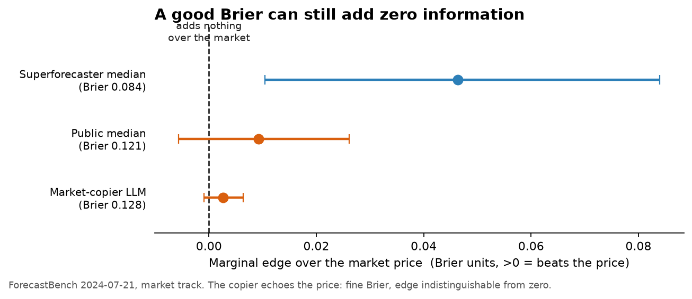
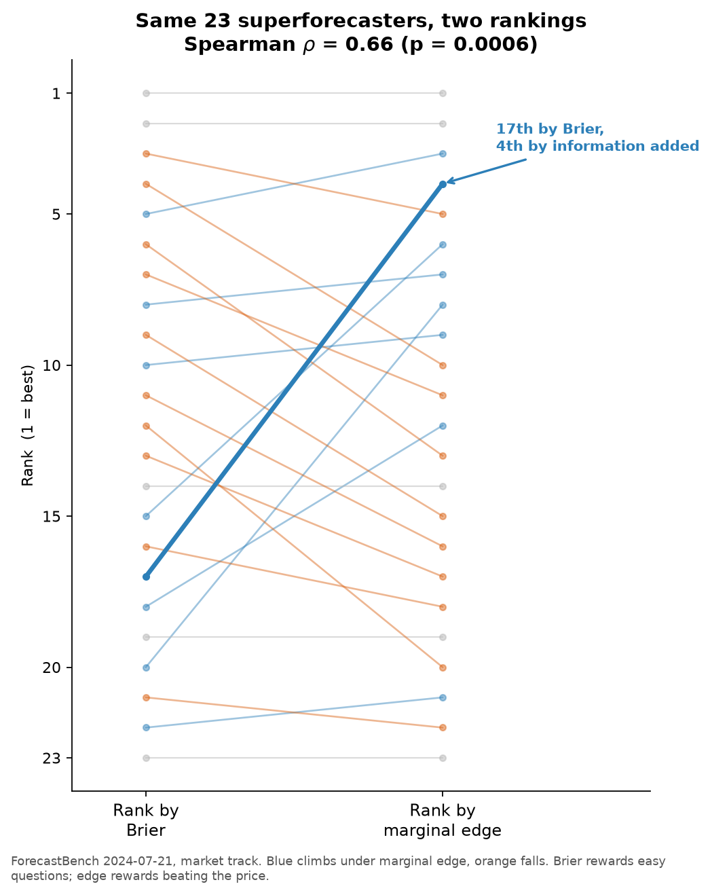

# beyond-brier

**A lot of "AI beats the crowd" results are smaller than a statistical artifact. Here is the one-line check, and a reorder of the only public board.**

A forecaster can post a near-superforecaster Brier score by quietly echoing a market price or a crowd median, while contributing nothing of its own. Brier cannot tell the copyist apart from the contributor. `beyond-brier` scores the thing you actually want: the **marginal edge**, the calibrated information a forecast adds *over the strongest freely available prior*, ranked by a strictly proper rule and split into a *priced* part (recoverable from the prior) and an *unpriced* part (the forecaster's own contribution).

It is the reference implementation for the paper *Beyond Brier: A Marginal-Edge Skill Score for Forecasting, and What It Does to a Leaderboard* ([`docs/paper.pdf`](docs/paper.pdf)).

```bash
pip install beyond-brier
```



*Real ForecastBench data. The market-copier has a perfectly respectable Brier (0.128) and an edge over the price that is indistinguishable from zero. Only the superforecasters clear the line.*

---

## The 0.5/N free lunch

Here is the trap, in one line. Take any forecaster, add its prediction as a single extra regressor to a model that already has the market price. Under the null that the forecast adds **nothing**, the in-sample log-likelihood still rises by `0.5/N` nats in expectation (Wilks' theorem: the likelihood-ratio statistic for one parameter has mean 1, i.e. half a nat of log-likelihood, spread across `N` questions).

A lot of reported "LLMs beat the crowd" edges are smaller than this artifact. `beyond_brier.debias_logscore` subtracts it. Honest out-of-sample edges do not need the correction; in-sample ones do, and most leaderboards never apply it.

---

## The board reorders

Score is not rank. On the one public, leak-free ForecastBench slice (2024-07-21, 540 human forecasters, 33,271 binary rows), ranking the 23 rankable superforecasters by marginal edge instead of Brier moves the board substantially: **Spearman rho = 0.66 (p = 0.0006)**. One forecaster sits **17th by Brier and 4th by the information it adds**, because it beat the market on hard questions instead of padding its Brier on easy ones.



Of the 23, **7 have an edge interval strictly above zero** and **6 survive Benjamini-Hochberg FDR** at q = 0.10. The pooled forecast-encompassing regression confirms superforecasters carry information beyond the market price (`b_fc = +0.57`, question-clustered `p = 0.005`) while the price adds little to them.

Regenerate both figures from the public files with `python examples/make_figures.py`.

---

## 60-second tour

```python
import numpy as np
from beyond_brier import marginal_edge

y      = np.array([1, 0, 1, 0, 1])                  # resolved outcomes
price  = np.array([0.55, 0.40, 0.60, 0.35, 0.70])  # the free prior (market / crowd)
mine   = np.array([0.80, 0.25, 0.75, 0.30, 0.85])  # my forecast

print(marginal_edge(mine, price, y))
# EdgeResult(edge=+0.09150, n=5, se=0.02141, score='brier')   # > 0: I beat the price
```

A whole field at once:

```python
from beyond_brier import build_leaderboard, reorder_stats
# long table: one row per (forecaster, question) with columns
#   forecaster, question, p_f, p_ref, y
board = build_leaderboard(df, min_n=20)
print(reorder_stats(board))
```

Run `python examples/quickstart.py` to see the punchline on synthetic data: a market-copier inherits the market's Brier exactly and adds zero edge, while a contributor at a comparable Brier carries real signal. And the identity that keeps the metric honest: on a *constant* prior, ranking by edge is exactly ranking by Brier, so the metric can only reorder a board where the prior is informative and question-varying.

---

## The honest leaderboard

A forecaster earns its place by what it adds over the price. Submit a CSV of `question, p_f, p_ref, y`, get scored, get ranked. The board is a flat JSON file anyone can recompute. See [`LEADERBOARD.md`](LEADERBOARD.md).

```bash
python -m data.fetch                                  # public ForecastBench files
python -m leaderboard.seed_from_forecastbench         # human reference points
python -m leaderboard.submit add --name "My bot" --kind bot --forecasts mine.csv
```

Seeded from the public ForecastBench human round, the board already makes the point:

| Forecaster | Edge over market | 95% CI | Mean Brier | Unpriced signal? |
|---|---:|---|---:|:---:|
| Superforecaster median | **+0.046** | [+0.011, +0.084] | 0.084 | **yes** |
| Public median | +0.009 | [-0.006, +0.026] | 0.121 | no |
| Market-copier LLM (demo) | +0.003 | [-0.001, +0.006] | 0.128 | no |

The copier's raw Brier looks respectable. Its edge is indistinguishable from zero. That is the whole idea.

---

## Reproduce the paper

```bash
python -m data.fetch
python examples/reproduce_paper.py
```

On the public, leak-free ForecastBench slice the tool reproduces the paper's headline:

- **Market track** (informative prior): ranking by the difficulty-adjusted edge reorders the Brier ranking at **Spearman rho = 0.66 (p = 0.0006)**. Of 23 rankable superforecasters, 7 have an edge interval strictly above zero (6 survive FDR), and the pooled encompassing regression shows superforecasters carry information beyond the market price (`b_fc > 0`, question-clustered `p = 0.005`) while the price adds little to them.
- **Data track** (no informative prior, constant 0.5): edge ranking equals Brier ranking to machine precision (`rho = 1.000`). This is the identity check, not a result, and the tool reports it as such.

---

## What the metric is

Per question `i` with outcome `y_i`, prior `p_ref_i`, forecast `p_f_i`, and a strictly proper score `S` (Brier primary, log as a robustness check):

```
edge_i = S(p_ref_i, y_i) - S(p_f_i, y_i)        # > 0 means "beat the prior"
```

We aggregate the **difference** of two proper scores, never the skill-score ratio `1 - sum S_f / sum S_ref`, which is biased and small-sample fragile (Wheatcroft, 2019). Cross-forecaster comparison uses a difficulty-adjusted forecaster effect from a two-way fixed-effects model over the per-question edges (`beyond_brier.adjust`), so a forecaster cannot look good by answering an easier question mix. The priced/unpriced split comes from a forecast-encompassing logit with question-clustered standard errors (`beyond_brier.decompose`). Inference is a percentile bootstrap over questions with Benjamini-Hochberg FDR control (`beyond_brier.stats`).

For the full treatment, including the prior art we build on (skill scores, Murphy's decomposition, Prophet Arena, the AIA Forecaster), read the [paper](docs/paper.pdf).

---

## What this is, and what it is not

This is a **ruler**, not a racehorse. It tells you how to *score* a forecaster against the market. It contains no forecasting model, no data feeds, and no alpha: nothing here helps you *be* a better forecaster, only measure one honestly. That is deliberate. Better measurement is a public good; we are happy to give it away.

We are also explicit about scope. The natural target, recomputing the *LLM* leaderboard under marginal edge, is not possible from public data today: ForecastBench releases per-question forecasts only for humans, on one round. So we demonstrate on humans and **pre-register** the LLM result as a forward, falsifiable prediction with this exact code as the fixed instrument. See [`docs/PROTOCOL.md`](docs/PROTOCOL.md).

---

## Install from source

```bash
git clone https://github.com/vaticinus/beyond-brier
cd beyond-brier
pip install -e ".[dev]"
pytest -q          # 40 tests
```

## Cite

```bibtex
@misc{beyondbrier2026,
  title  = {Beyond Brier: A Marginal-Edge Skill Score for Forecasting, and What It Does to a Leaderboard},
  author = {Vaticinus T.},
  year   = {2026},
  note   = {https://github.com/vaticinus/beyond-brier}
}
```

Apache-2.0. Contributions, replications, and adversarial bug reports are all welcome.
