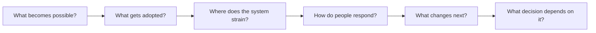

# Vaticinus

### Building superforecaster AI in the open.

We're working on forecasts that help people decide what to build, where to invest, and which research is worth pursuing. This repository contains the tools and experiments behind that work.

**[Vaticinus.com](https://vaticinus.com)** · [Try the workbench](https://huggingface.co/spaces/vaticinus/forecast-stack) · [Run the code](#run-it-yourself) · [Results](#what-weve-learned-so-far)


## Why work on this now?

In July 2026, the Forecasting Research Institute reported that several AI systems were statistically indistinguishable from its superforecaster reference on ForecastBench. The comparison has limits: the human forecasts date from 2024, and the results support parity more strongly than outperformance. [Their report explains both the progress and the uncertainty.](https://forecastingresearch.substack.com/p/ai-models-have-likely-reached-parity)

We want to find out how much of that progress can carry into everyday decisions. Could a small research team get a useful second opinion on its next program? Could a developer spot the assumption most likely to delay a project? How early could a forecast flag a supply constraint that people are still treating as temporary?

Those questions need more than access to a capable model. Someone has to choose the evidence, define the outcome, and check whether the forecast helped. Vati is our attempt to make that work easier to do and easier for someone else to examine.

## Where we look

We're interested in what happens after a new capability arrives: who adopts it, where demand runs ahead of supply, and how people respond.



Consider cheaper AI. More use could increase demand for compute and electricity; efficiency gains could offset some of it. Grid access and equipment lead times might then matter more than another improvement in the model. That gives you several different things to investigate before forecasting which projects get built.

This is an example of the reasoning we want to test, not a published prediction about energy demand.

| Area | Questions to investigate |
|---|---|
| Technology & infrastructure | What becomes practical? What prevents deployment from scaling? |
| Economics & markets | Where does supply fall short? Who can expand it, and how quickly? |
| Politics & institutions | Which decision would change the path? What could force a reversal? |
| Science & research | Which milestone is credible? What evidence would change the estimate? |

## From a question to a forecasting record

The open toolkit includes public-data collectors and forecasting baselines, plus a harness for reviewing model answers. You can use the probability engine separately, or run the workflow with your own model key.

1. Define the event, its deadline, and the source that will settle it.
2. Collect evidence and state the assumptions the forecast depends on.
3. Generate an estimate. Compare the direct model with additional review, rather than assuming review improves it.
4. Save the original forecast. When the outcome arrives, score it against a baseline and examine the misses.

The record keeps the question and evidence alongside the estimate. Revisions link to earlier forecasts so you can see how the view changed.

[Forecasting workflow](forecast-stack/forecast-core/WORKFLOW.md) · [Toolkit contents](forecast-stack/README.md) · [Architecture](forecast-stack/docs/ARCHITECTURE.md)

## Try it on a question you know well

In the **[live workbench](https://huggingface.co/spaces/vaticinus/forecast-stack)**, you can change a scenario's assumptions and download the resulting calculation. The scenario tools need no API key.

The [model-backed workflow](forecast-stack/forecast-core/WORKFLOW.md) uses your own OpenRouter key and a spending limit. It supports evidence packets, forecast revisions, and comparisons between a direct model and the harness. You can run it on your own machine.

### Run it yourself

Node 22.18 or newer. The workbench starts without installing dependencies:

```sh
git clone https://github.com/vaticinus/vati.git
cd vati/forecast-stack
node --experimental-strip-types space/server.mts
# Open http://localhost:7860
```

[Python quickstart](forecast-stack/README.md#start-without-keys) · [Model setup](forecast-stack/forecast-core/WORKFLOW.md#collect-evidence-and-issue-a-real-forecast) · [Release downloads](https://github.com/vaticinus/vati/releases)

## There are parts of this you'll understand better than we do

A power-systems researcher may spot a grid assumption we should never have made. Someone who follows a region closely may know why the English-language reporting is misleading. That knowledge can change a forecast more than another round of model calls.

The repository leaves room to work on a small, concrete piece: a source with reliable publication dates, a better baseline for one question class, or a test that catches a convincing but wrong answer. You don't need a paid API account to reproduce the offline examples or inspect the released results.

[Open work](forecast-stack/docs/ROADMAP.md) · [Run a comparison](forecast-stack/docs/SUPERFORECASTING.md) · [Working on the project](forecast-stack/CONTRIBUTING.md)

## What we've learned so far

Vati has not demonstrated superforecaster-level performance, a reliable harness advantage, or readiness for major decisions. The field's results are a reason to pursue this project; they are not results for our system.

Our experiments include:

- [All eight 2025 FOMC meetings](forecast-stack/benchmarks/historical-2025-fomc/RESULTS.md), using older checkpoints. The harness results were mixed, and the report describes reasoning failures and contamination limits.
- [A prospective macro pilot](forecast-stack/benchmarks/prospective-2026-09-22/RESULTS.md), with issued forecasts and failed attempts preserved. It does not provide a paired accuracy result.
- [Controlled reasoning tests](forecast-stack/benchmarks/2026-09-22/RESULTS.md), used to find and repair errors. These do not measure real-world forecasting skill.

The [evaluation guide](forecast-stack/docs/SUPERFORECASTING.md) describes the evidence we'd need before making a stronger claim, including fresh outcomes and independent replication.

## Beyond Brier

The independent [Beyond Brier package](BEYOND_BRIER.md) measures what a forecast adds over a declared reference, such as a market price. Its paper, figures and leaderboard documentation are available separately.

The forecasting tools live in [`forecast-stack/`](forecast-stack/) under [MIT](forecast-stack/LICENSE). Installing the root Python package installs Beyond Brier, which retains [Apache-2.0](LICENSE). Third-party data and models retain their own terms.

[Vaticinus.com](https://vaticinus.com) · [Security](forecast-stack/SECURITY.md) · [Governance](forecast-stack/GOVERNANCE.md)
